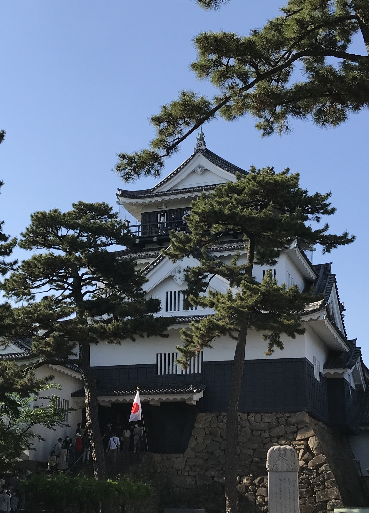

I was born and grown up mostly in the (relatively) central and eastern part of the main island in Japan. I was born in Aichi Prefecture, where Toyota, the car manufacturer, is headquartered. I briefly lived in Saitama, near Tokyo, for five years, before I moved back to Aichi where I lived for the rest of my time in Japan.

```{r echo = FALSE, out.width = "25%", out.extra = "angle=90"}

```


## Railway & Travelling

I picked up an interest in trains when I was a young kid. The interest in railway somehow survives in me and I enjoy travelling on rail! 

```{r echo = FALSE, out.width = "25%", out.extra='style="float:left; padding:10px"'}
knitr::include_graphics("images/profile.png")
```


## Music

## Beer


 