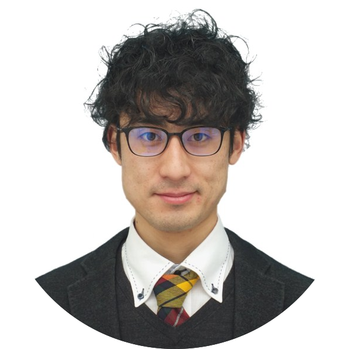

```{r echo = FALSE, out.width = "25%", out.extra='style="float:left; padding:10px"'}

```

<br>
<br>
I am a 3rd year PhD student at Lancaster University, UK. I use ultrasound tongue imaging to investigate articulation in second language speech, particularly English liquids produced by L1 Japanese speakers. 
<br>
<br>
Also follow me on:&nbsp;&nbsp;<a href='https://researchmap.jp/takayukinagamine' target='_blank'></a> &nbsp;<a href='https://www.researchgate.net/profile/Takayuki_Nagamine' target='_blank'></a> <a href='https://twitter.com/tn75146488' target='_blank'></a>

