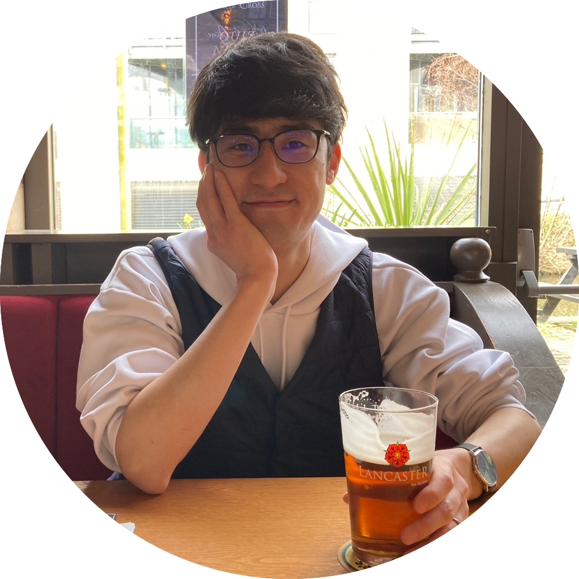

<style type="text/css">

body, td {
   font-size: 16px;
}
<!-- code.r{ -->
<!--   font-size: 12px; -->
<!-- } -->
<!-- pre { -->
<!--   font-size: 12px -->
<!-- } -->
</style>


```{r echo = FALSE, out.width = "40%", out.extra='style="float:left; padding:50px"'}

```


<br>
I am Research Assistant (to be a Postdoctoral Research Fellow) in [Speech, Hearing and Phonetic Sciences (SHaPS), University College London](https://www.ucl.ac.uk/pals/research/speech-hearing-and-phonetic-sciences) for the Leverhulme-funded project **"Speech production processes in resolving articulatory variation"**.


<!-- My research interest lies in bilingual/second language (L2) speech production, informed by experimental methods in articulatory/acoustic phonetics and laboratory phonology, and I am currently learning how these articulatory methods could augment psycholinguistic and neurolinguistics research for the project.  -->


I am also completing my PhD research in [the Department of Linguistics and English Language, Lancaster University ](https://www.lancaster.ac.uk/linguistics/) (funded by [Japan Student Services Organisation (JASSO)](https://www.jasso.go.jp/ryugaku/scholarship_a/daigakuin/index.html) and [The Murata Science Foundation](https://corporate.murata.com/ja-jp/group/zaidan)). I investigate acoustic/articulatory dynamics of L2 English liquids produced by L1 Japanese speakers using ultrasound tongue imaging and quantitative data analysis methods. 


My CV can be downloaded [here](https://github.com/TakayukiNagamine/takayukinagamine.github.io/raw/main/papers/Takayuki_Nagamine_CV.pdf) (last updated: 11 September 2024).

Also follow me on:&nbsp;&nbsp;<a href='https://researchmap.jp/takayukinagamine' target='_blank'></a> 
<a href='https://twitter.com/tn75146488' target='_blank'></a> 
<a href='https://github.com/TakayukiNagamine' target='_blank'></a> 
<a href="https://orcid.org/0000-0002-0936-4738">

</a>

<!-- <a href='https://www.researchgate.net/profile/Takayuki_Nagamine' target='_blank'></a>  -->

<br>
<br>


### Research interests

 &nbsp; **Articulatory Phonetics**

 &nbsp; **Ultrasound Tongue Imaging**

 &nbsp; **Second Language Acquisition**

 &nbsp; **Quantitative Analysis**

<br>

### Current projects

 &nbsp; **Speech production processes in resolving articulatory variation** (Postdoc project, 2024--present)

&nbsp;&nbsp;&nbsp;&nbsp;&nbsp;&nbsp;&nbsp;&nbsp;&nbsp;&nbsp;&nbsp;&nbsp;&nbsp;&nbsp;&nbsp;&nbsp; PIs: [Professor Patti Adank](https://profiles.ucl.ac.uk/19877) (UCL), [Dr Chris Carignan](https://sites.google.com/view/christopher-carignan/home) (UCL) and [Professor Adamantios Gafos](https://www.ling.uni-potsdam.de/~gafos/) (Universität Potsdam). 

 &nbsp; **Dynamics in L2 speech: L1 Japanese speakers' production of English liquids** (PhD project, 2020--present)


&nbsp;&nbsp;&nbsp;&nbsp;&nbsp;&nbsp;&nbsp;&nbsp;&nbsp;&nbsp;&nbsp;&nbsp;&nbsp;&nbsp;&nbsp;&nbsp; Supervisors: [Professor Claire Nance](https://clairenance.github.io/) and [Dr Sam Kirkham](https://samkirkham.github.io/) (Lancaster University)

<!--  &nbsp; **[Lancashire Tongues: Ultrasound study of dialects in Lancashire](https://www.research.lancs.ac.uk/portal/en/upmprojects/lancashire-tongues(dcb56b68-d20e-4acd-92b0-0ffa6b23c07c).html)** (2022--present) -->

<!-- &nbsp;&nbsp;&nbsp;&nbsp;&nbsp;&nbsp;&nbsp;&nbsp;&nbsp;&nbsp;&nbsp;&nbsp;&nbsp;&nbsp;&nbsp;&nbsp; Conveners: [Claire Nance](https://clairenance.github.io/), [Sam Kirkham](https://samkirkham.github.io/) and [Danielle Turton](https://danielleturton.rbind.io/) (Lancaster University) -->

 &nbsp; **U-DNR: Articulatory characterisation of Japanese liquids using ultrasound** (2023--present)

&nbsp;&nbsp;&nbsp;&nbsp;&nbsp;&nbsp;&nbsp;&nbsp;&nbsp;&nbsp;&nbsp;&nbsp;&nbsp;&nbsp;&nbsp;&nbsp; Co-researcher: [Dr Maho Morimoto](https://sites.google.com/view/mamorimo/) (Chuo University/Sophia University)


<br>

### Education
 &nbsp; **2020 - Present** &nbsp; **PhD Candidate in Linguistics, [Lancaster University](https://www.lancaster.ac.uk/), UK.**

&nbsp;&nbsp;&nbsp;&nbsp;&nbsp;&nbsp;&nbsp;&nbsp;&nbsp;&nbsp;&nbsp;&nbsp;&nbsp;&nbsp;&nbsp;&nbsp;Supervisors: [Professor Claire Nance](https://clairenance.github.io/) and [Dr Sam Kirkham](https://samkirkham.github.io/)

&nbsp;&nbsp;&nbsp;&nbsp;&nbsp;&nbsp;&nbsp;&nbsp;&nbsp;&nbsp;&nbsp;&nbsp;&nbsp;&nbsp;&nbsp;&nbsp;See also: [Lancaster University Phonetics Lab](https://phoneticslab.github.io/)

 &nbsp; **2015 - 2016** &nbsp; **Master of Arts in Linguistics (with Merit), [University College London](https://www.ucl.ac.uk/), UK.**

&nbsp;&nbsp;&nbsp;&nbsp;&nbsp;&nbsp;&nbsp;&nbsp;&nbsp;&nbsp;&nbsp;&nbsp;&nbsp;&nbsp;&nbsp;&nbsp;Dissertation supervisor: [Dr Bronwen Evans](https://profiles.ucl.ac.uk/8727-bronwen-evans)

 &nbsp; **2010 - 2015** &nbsp; **Bachelor of Arts in Education Studies, [Aichi University of Education](https://www.aichi-edu.ac.jp/), Japan.**

&nbsp;&nbsp;&nbsp;&nbsp;&nbsp;&nbsp;&nbsp;&nbsp;&nbsp;&nbsp;&nbsp;&nbsp;&nbsp;&nbsp;&nbsp;&nbsp;Thesis supervisor: [Professor Yasuhiro Fujiwara](https://www.meijo-u.ac.jp/sp/foreign/educator/fujiwara/) (Now at Meijo University, Japan)

<br>

### Skills

 &nbsp; **Japanese** (Native), **English** (Fluent, CEFR: C1), **German** (Beginner, CEFR: A2)

 &nbsp; **R / R Studio**, **Praat**, **Gorilla**, **Microsoft Office**, **LaTeX**, **Moodle**

 &nbsp; **Ultrasound tongue imaging ([Articulate Assistant Advanced](http://www.articulateinstruments.com/aaa/))**, **Acoustic analysis**, **Statistical analysis**

----------
icons by <a href="https://icons8.com">Icons8