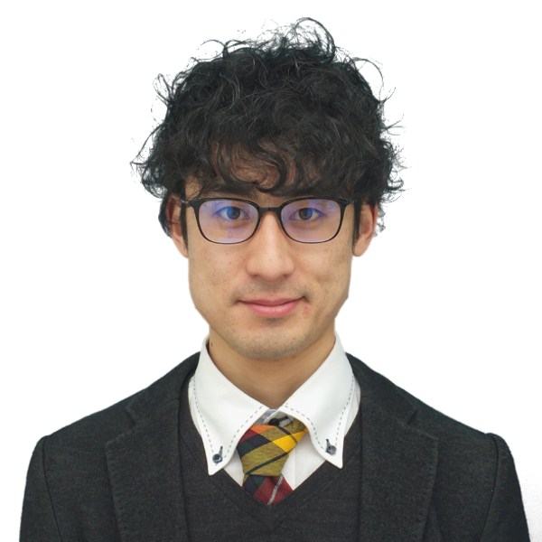

```{r echo = FALSE, out.width = "25%", out.extra='style="float:left; padding:10px"'}

```


I am a 3rd year PhD student at Lancaster University, UK. I use ultrasound tongue imaging to investigate articulation in second language speech, particularly English liquids produced by L1 Japanese speakers. 

