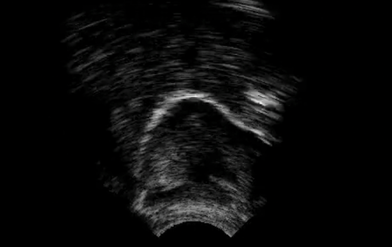
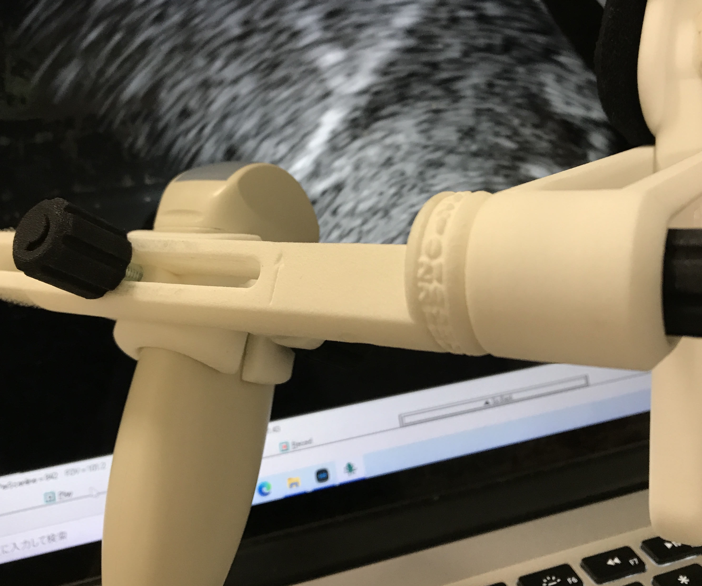
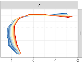
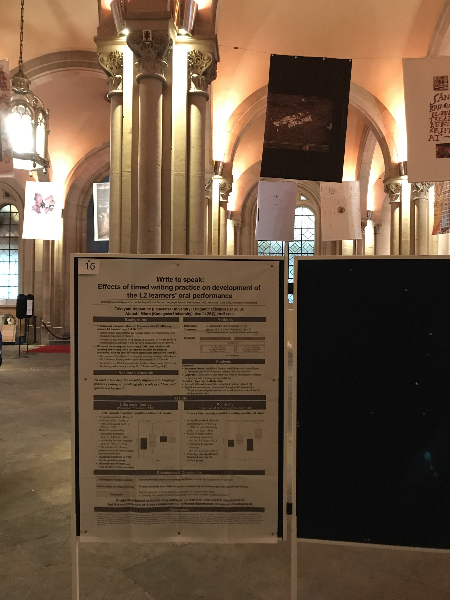

<style type="text/css">

body, td {
   font-size: 16px;
}
<!-- code.r{ -->
<!--   font-size: 12px; -->
<!-- } -->
<!-- pre { -->
<!--   font-size: 12px -->
<!-- } -->
</style>

Here, I introduce some of my research outputs by research projects. For a complete list of publications and presentations, please see my [CV](https://github.com/TakayukiNagamine/takayukinagamine.github.io/raw/main/papers/Takayuki_Nagamine_CV.pdf) or visit [my researchmap page](https://researchmap.jp/takayukinagamine). 


-----

## **Dynamics in L2 speech: L1 Japanese speakers’ production of English liquids**

```{r echo = FALSE, out.width = "40%", out.extra='style="float:right; padding:10px"'}

```

In my PhD project, I investigate acoustic and articulatory dynamics in L1 Japanese speakers' production of English liquids. 

### Peer-reviewed Journal article

- **Nagamine, T.** (2024). Formant dynamics in second language speech: Japanese speakers' production of English liquids. *The Journal of Acoustical Society of America, 155*(1), 479-495. [https://doi.org/10.1121/10.0024351](https://doi.org/10.1121/10.0024351) [[pdf]](https://github.com/TakayukiNagamine/takayukinagamine.github.io/raw/main/papers/nagamine_2024_jasa.pdf) [[osf]](https://osf.io/2phx5/) <br> (&copy; 2024 Author(s). This article is distributed under a Creative Commons Attribution (CC BY) License.)

### Conference proceedings paper

- **Nagamine, T.** (2023). Dynamic tongue movements in L1 Japanese and L2 English liquids. In R. Skarnitzl & J. Volín (Eds.), *Proceedings of the 20th International Congress of Phonetic Sciences* (pp. 2442–2446). Guarant International. [https://guarant.cz/icphs2023/198.pdf](https://guarant.cz/icphs2023/198.pdf)  [[pdf]](https://github.com/TakayukiNagamine/takayukinagamine.github.io/raw/main/papers/nagamine_2023_icphs.pdf) [[osf]](https://osf.io/29tac/)

- **Nagamine, T.** (2022). Acquisition of allophonic variation in second language speech: An acoustic and articulatory study of English laterals by Japanese speakers. *Proceedings of Interspeech 2022* (pp. 644-648). https://doi.org/10.21437/Interspeech.2022-11020 [[pdf]](https://github.com/TakayukiNagamine/takayukinagamine.github.io/raw/main/papers/nagamine_2022_interspeech.pdf)

### Conference presentation

- **Nagamine, T.** (2024, May 13-17). *Acquisition of articulatory dynamics in second language speech: Japanese speakers’ production of English and Japanese liquids.* (Poster presentation). The 13th International Seminar on Speech Production (ISSP), L'Escandille, Autrans, France. [[poster]](https://github.com/TakayukiNagamine/takayukinagamine.github.io/raw/main/papers/nagamine_2024_issp_poster.pdf) [[abstract]](https://github.com/TakayukiNagamine/takayukinagamine.github.io/raw/main/papers/nagamine_2024_issp_abstract.pdf)

- **Nagamine, T.** (2024, March 25-27). *Using Functional Principal Component Analysis for articulatory dynamics of English liquids: L1 Japanese speakers' production of English /l ɹ/ and Japanese /ɾ/.* (Oral presentation). The Colloquium of the British Association of Academic Phoneticians 2024 (BAAP2024), Cardiff University, Cardiff, United Kingdom. [[abstract]](https://github.com/TakayukiNagamine/takayukinagamine.github.io/raw/main/papers/nagamine_2024_baap2024_abstract.pdf)

- **Nagamine, T.** (2023, August 7-11). *Dynamic tongue movements in L1 Japanese and L2 English liquids.* (Oral presentation). The 20th International Congress of Phonetic Sciences (ICPhS), Prague Congress Centre, Prague, Czech Republic. [[slides]](https://github.com/TakayukiNagamine/takayukinagamine.github.io/raw/main/papers/nagamine_2023_icphs_slides.pdf)

- **Nagamine, T.** (2022, November 3-4). *Acoustic, perceptual and articulatory properties of second language speech; A case of Japanese speakers’ production of the English /l r/ contrast.* (Oral presentation). Ultrafest X, University of Manchester, Manchester, United Kingdom. [[slides]](https://github.com/TakayukiNagamine/takayukinagamine.github.io/raw/main/papers/nagamine_2022_ultrafest_slides.pdf)

- **Nagamine, T.** (2022, September 18-22). *Acquisition of allophonic variation in second language speech: An acoustic and articulatory study of English laterals by Japanese speakers.*　(Oral presentation). Interspeech2022: The 2022 Conference of the International Speech Communication Association, Songdo ConvensiA, Incheon, South Korea. [[slides]](https://github.com/TakayukiNagamine/takayukinagamine.github.io/raw/main/papers/nagamine_2022_interspeech_slides.pdf)

- **Nagamine, T.** & Suzuki, S. (2022, April 4-8). *Dynamic phonetic correlates of liquid contrasts in Japanese speakers of English.* (Oral presentation). BAAP 2022: Colloquium of the British Association of Academic Phoneticians, University of York (online), York, United Kingdom.

### Press coverage

University press articles (in Japanese) reporting activities with students using ultrasound.

- 14 June 2024 at [Kobe Gakuin University](https://www.kobegakuin.ac.jp/education/faculty_global/news/1cd4b5e323bfdfa323ce.html), Hyogo, Japan.

- 31 October 2022 at [Meijo University](https://www.meijo-u.ac.jp/news/detail_28009.html), Aichi, Japan.

- 18 October 2022 at [Kobe Gakuin University](https://www.kobegakuin.ac.jp/education/faculty_global/news/988939cb1a72698c58a1.html), Hyogo, Japan.

-----

## **Language variation and change**

```{r echo = FALSE, out.width = "30%", out.extra='style="float:right; padding:10px"'}

```

I am involved in projects investigating language variation and change using articulatory methods. This includes the [Lancashire Tongues: Ultrasound study of dialects in Lancashire](https://www.research.lancs.ac.uk/portal/en/upmprojects/lancashire-tongues(dcb56b68-d20e-4acd-92b0-0ffa6b23c07c).html) project and the [Targets and Dynamics in Speech (TARDIS)](https://www.research.lancs.ac.uk/portal/en/upmprojects/targets-and-dynamics-in-speech--tardis(0af620e8-b3d8-4a76-93c1-f316a2a1dc52).html) project.

### Peer-reviewed Journal article

- Nance, C., Dewhurst, M., Fairclough, L., Forster, P., Kirkham, S., Lo, J., McMonagle, J., **Nagamine, T.**, Parkman, S., Rabani, H., Siem, A. B., Turton D., & Wang, S. (Forthcoming.) Articulatory phonetics in the Market: Combining public engagement with ultrasound data collection. *Linguistics Vanguard*.

- Strycharczuk, P., Kirkham, S., Gorman, E., & **Nagamine, T**. (Forthcoming). Towards a dynamical model of English vowels: Evidence from diphthongisation. *Journal of Phonetics*. [pre-print](https://arxiv.org/abs/2409.00275) [code](https://osf.io/gub32/)


### Conference proceedings paper

- Nance, C., Dewhurst, M., Fairclough, L., Forster, P., Kirkham, S., **Nagamine, T.**, Turton, T., & Wang, D. (2023). Acoustic and articulatory characteristics of rhoticity in the North-West of England. In R. Skarnitzl & J. Volín (Eds.), *Proceedings of the 20th International Congress of Phonetic Sciences* (pp. 3573–3577). Guarant International. [https://guarant.cz/icphs2023/217.pdf](https://guarant.cz/icphs2023/217.pdf)  [[pdf]](https://github.com/TakayukiNagamine/takayukinagamine.github.io/raw/main/papers/nance_et_al_2023_icphs.pdf) [[osf]](https://osf.io/wb9m5/) (Lancashire Tongues)

- Kirkham, S., Strycharczuk, P., Gorman, E., **Nagamine, T.**, & Wrench, A. (2023). Co-registration of high-speed ultrasound and electromagnetic articulography for speech production research. In R. Skarnitzl & J. Volín (Eds.), *Proceedings of the 20th International Congress of Phonetic Sciences* (pp. 918-922). Guarant International. [https://guarant.cz/icphs2023/145.pdf](https://guarant.cz/icphs2023/145.pdf)  [[pdf]](https://github.com/TakayukiNagamine/takayukinagamine.github.io/raw/main/papers/kirkham_et_al_2023_icphs.pdf) [[github]](https://github.com/samkirkham/ultrafit-ema) (TARDIS)

### Conference presentation

- Nance, C., Dewhurst, M., Fairclough, L., Forster, P., Kirkham, S., Lo, J., McMonagle, J., **Nagamine, T.**, Parkman, S., Rabani, H., Turton, D., & Wang. D. (2024, 27-28 June). *Residual rhoticity in East Lancashire English: variation in Blackburn and Burnley.* (Oral presentation). The 10th Northern Englishes Workshop (NEW10), University of Chester, Chester, United Kingdom. (Lancashire Tongues)

- Strycharczuk, P., Kirkham, S., Gorman, E., **Nagamine, T.**, & Leeman, A. (2024, June 27-29). *Gender-specific behaviour in vowel articulation.* (Oral presentation). The 19th Conference on Laboratory Phonology: LabPhon 19, HIPCS, Hanyang University, Seoul, South Korea. (TARDIS)

- Strycharczuk, P., Kirkham, S., Gorman, E., & **Nagamine, T.** (2024, March 25-27). *Dimensions of stability in vowel articulation*. (Oral presentation). Accepted for The Colloquium of the British Association of Academic Phoneticians 2024 (BAAP2024), Cardiff University, Cardiff, United Kingdom. (TARDIS) 

- Nance, C., Dewhurst, M., Fairclough, L., Forster, P., Kirkham, S., **Nagamine, T.**, Turton, T., & Wang, D. (2023, August 7-11). *Acoustic and articulatory characteristics of rhoticity in the North-West of England*. (Oral presentation). The 20th International Congress of Phonetic Sciences (ICPhS), Prague Congress Centre, Prague, Czech Republic. (Lancashire Tongues)

- Kirkham, S., Strycharczuk, P., Gorman, E., **Nagamine, T.**, & Wrench, A. (2023, August 7-11). *Co-registration of high-speed ultrasound and electromagnetic articulography for speech production research*. (Oral presentation). The 20th International Congress of Phonetic Sciences (ICPhS), Prague Congress Centre, Prague, Czech Republic. (TARDIS)

### Press coverage

The Lancashire Tongue project has been featured in local/national news:

- 7 November 2023 on BBC Lancashire [Study to look at why Burnley and Blackburn 'speak very differently'](https://www.bbc.co.uk/news/uk-england-lancashire-67345388)

- 12 November 2023 on [BBC North West](https://www.facebook.com/BBCNW/videos/866637831714994)

-----

## **DNR: Articulatory characterisation of Japanese liquids using ultrasound**

```{r echo = FALSE, out.width = "25%", out.extra='style="float:right; padding:10px"'}


```

I collaborate with [Maho Morimoto](https://sites.google.com/view/mamorimo/) (Chuo University) to investigate phonetics of phonology of consonants in Japanese using articulatory methods (ultrasound, electromagnetic articulograph). 

### Conference proceedings paper

- Morimoto, M., & **Nagamine, T**. (2024). Spatio-temporal properties of Japanese coronal consonants: An ultrasound study of /d/ and /r/. In C. Fougeron & P. Perrier (Eds). *Proceedings of the 13th International Seminar on Speech Production (ISSP)* (pp. 31-34). \url{https://doi.org/10.21437/issp.2024-9} [[pdf]](https://github.com/TakayukiNagamine/takayukinagamine.github.io/raw/main/papers/morimoto_nagamine_2024_issp.pdf)

### Conference presentation

- Morimoto, M., & **Nagamine, T**. (2024, May 13-17). *Spatio-temporal properties of Japanese coronal consonants: An ultrasound study of /d/ and /r/*. (Poster presentation). The 13th International Seminar on Speech Production (ISSP), L'Escandille, Autrans, France. [[poster]](https://github.com/TakayukiNagamine/takayukinagamine.github.io/raw/main/papers/morimoto_nagamine_2024_issp_poster.pdf)

### Miscellaneous

- **Nagamine, T.** & Morimoto, M. (2024, January 20). *Project U-DNR: Articulatory research of Japanese consonants /d n r/ using ultrasound* (Project overview). Linguistics Festival 2024, online, Japan. [[poster slides]](https://github.com/TakayukiNagamine/takayukinagamine.github.io/raw/main/papers/nagamine_morimoto_2024_dnr_poster.pdf)

-----

## **L2 pronunciation learning and teaching**

```{r echo = FALSE, out.width = "25%", out.extra='style="float:right; padding:10px"'}


```

I have also been involved in projects on L2 pronunciation teaching. I have worked with [Atsushi Miura](https://researchmap.jp/atsushimiura) (Waseda University, Japan) to investigate the use of technology in improving L2 fluency and with [Yuri Nishio](https://www.meijo-u.ac.jp/sp/foreign/educator/nishio/) (Meijo University, Japan) to investigate the effects of unfamiliar accents on L2 English listening. 

### Conference proceedings paper

- Miura, A., & **Nagamine, T.** (2022). Using synchronous computer-mediated communication to develop L2 learners’ oral fluency. In J. Levis & A. Guskaroska (eds.), *Proceedings of the 12th Pronunciation in Second Language Learning and Teaching Conference*. [https://doi.org/10.31274/psllt.13347](https://doi.org/10.31274/psllt.13347) [[pdf]](https://github.com/TakayukiNagamine/takayukinagamine.github.io/raw/main/papers/miura_nagamine_2021_psllt.pdf)

- **Nagamine, T.** (2020). Intelligibility of varieties of English and listeners’ language learning backgrounds. In O. Kang, S. Staples, K. Yaw, & K. Hirschi (Eds.), *Proceedings of the 11th Pronunciation in Second Language Learning and Teaching conference* (pp. 261–269). [https://iastatedigitalpress.com/psllt/article/id/15430/](https://iastatedigitalpress.com/psllt/article/id/15430/) [[pdf]](https://github.com/TakayukiNagamine/takayukinagamine.github.io/raw/main/papers/nagamine_2019_psllt.pdf)


### Conference presentation

- Miura, A., & **Nagamine, T.**. (2023, August 23-25). *Writing as your speaking practice tutor: Anatomizing the practice modality on L2 speaking training*. (Poster presentation) British Association for Applied Linguistics (BAAL) 56th Annual Conference, University of York, York, United Kingdom.

- **Nagamine, T.** & Nishio, Y. (2022, July 31). *Vowels in Asian Englishes Speech: Acoustics, Functional Load, and Implications to the Listening Pedagogy*. (Oral presentation) The 49th National Conference of the Japanese Association for Asian Englishes, online. 

- **Nagamine, T.** & Miura, A. (2022, April 20-22). *Write to speak: Effects of timed writing practice on development of the L2 learners' oral performance*. (Poster presentation) NewSounds 2022: The 10th International Symposium on the Acquisition of Second Language Speech, University of Barcelona, Barcelona, Spain.

- Miura, A., & **Nagamine, T.** (2021, June 18-19). *Using synchronous computer-mediated communication to develop L2 learners’ oral fluency*. (Poster presentation) Brock University (online), St. Catharines, Ontario, Canada. 

-----


For other research outputs, please see my [CV](https://github.com/TakayukiNagamine/takayukinagamine.github.io/raw/main/papers/Takayuki_Nagamine_CV.pdf) or visit my researchmap page: &nbsp; <a href='https://researchmap.jp/takayukinagamine' target='_blank'></a>