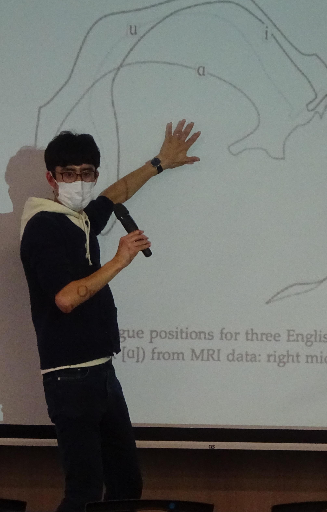

<style type="text/css">

body, td {
   font-size: 18px;
}
<!-- code.r{ -->
<!--   font-size: 12px; -->
<!-- } -->
<!-- pre { -->
<!--   font-size: 12px -->
<!-- } -->
</style>

<br>

-----

## **Phonetics/Phonology**

```{r echo = FALSE, out.width = "20%", out.extra='style="float:right; padding:10px"'}
# 
```

- **LING103 Linguistics** 

  - Lecturer: 1st year UG, Lancaster University (2022/23)

  - Six lectures on introductory Phonetics/Phonology and Japanese Phonetics/Phonology

- **LING221 Sounds of the world's languages** 

  - Seminar tutor: 2nd year UG, Lancaster University (2022/23)

  - Ten seminars on theoretical issues in Phonetics and acoustic analysis using Praat

- **LING223 English Phonetics** 

  - Seminar tutor: 2nd year UG, Lancaster University (2021/22)

  - Ten seminars on articulatory and acoustic phonetics of English sounds

- **English Phonetics** 

  - Lecturer: 1st year UG, Aichi Prefectural University (2017-19, 2020)

  - In Japanese: English Phonetics（愛知県立大学　外国語学部　英米学科）
  
  - 30 lectures on basic articulatory phonetics and practical pronunciation training

- **Introduction to English Phonetics** 

  - Lecturer: 1st year UG, Nagoya University of Foreign Studies (2018)

  - In Japanese: 英語音声学入門（名古屋外国語大学　外国語学部　英米語学科）
  
  - 15 lectures per semester on basic articulatory phonetics and practical pronunciation training

- **Language and sounds** 

  - Lecturer: 1st year UG, Nagoya University of Foreign Studies (2018-2019)

  - In Japanese: ことばと音声（名古屋外国語大学　現代国際学部　現代英語学科）

  - 15 lectures per semester on basic theoretical concepts in phonetics and data analysis

-----

## **English Language Teaching**

I have also taught English to undergraduate students between 2016 and 2020 at various universities in Japan, including:

  - Aichi University of Education (愛知教育大学)
  
  - Aichi University（愛知大学）
  
  - Aichi Prefectural Aichi High School of Technology and Engineering Advanced Course（愛知総合工科高校専攻科）
  
  - Meijo University（名城大学）
  
  - Nagoya Institute of Technology（名古屋工業大学）
  
  - Nagoya University of Foreign Studies（名古屋外国語大学）
  
  - Nagoya University of Arts（名古屋芸術大学）


-----

Please also see my researchmap page: &nbsp; <a href='https://researchmap.jp/takayukinagamine' target='_blank'></a>  


  